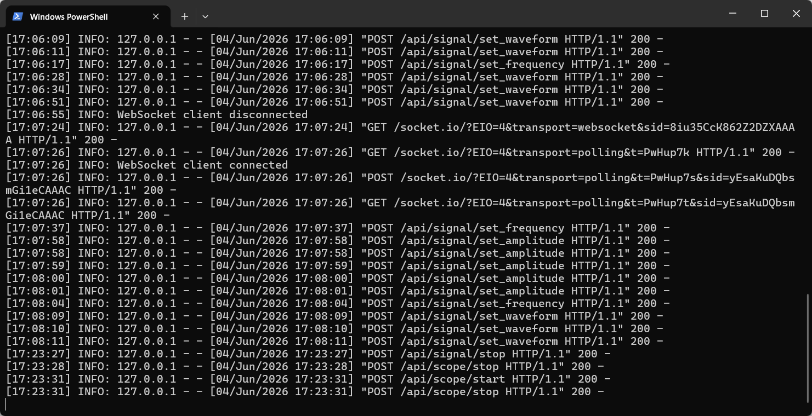
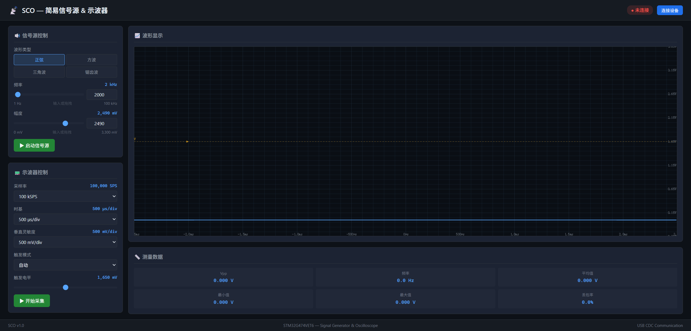
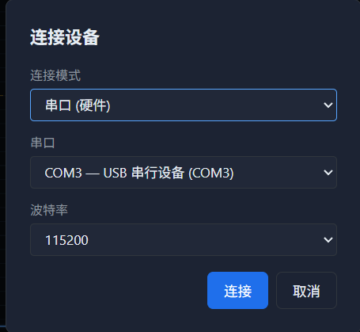
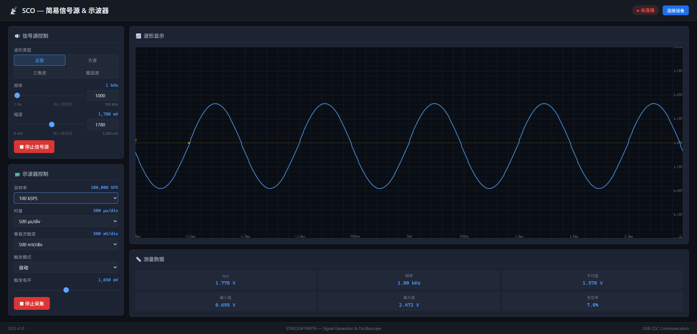
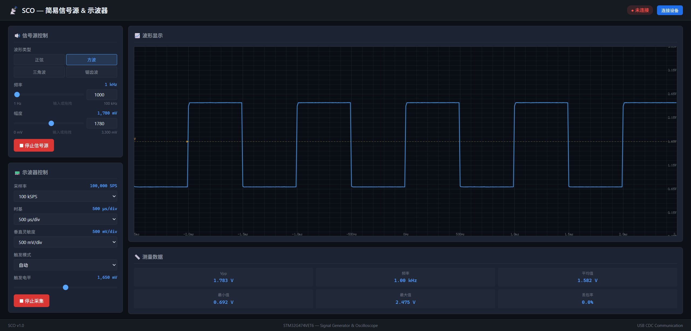
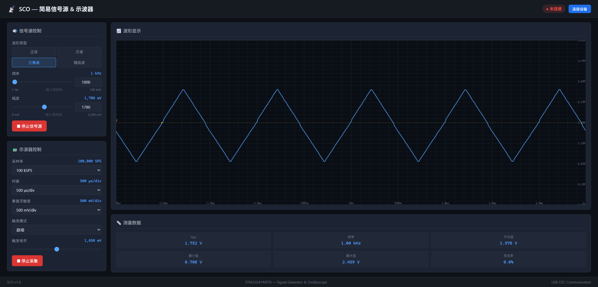
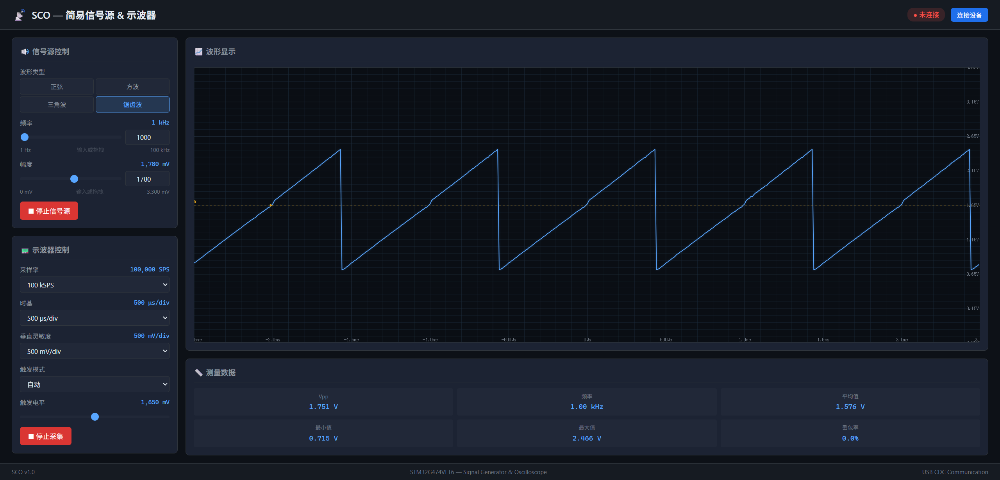

## SCO — 简易信号源与示波器

基于 STM32G474VET6 的 USB 虚拟示波器与信号发生器系统。仅需一根 USB 数据线连接电脑，即可在浏览器中生成波形信号并查看实时波形。

### 功能规格

| 项目 | 参数 |
|------|------|
| 信号源波形 | 正弦波、方波、三角波、锯齿波 |
| 信号源频率 | 1 Hz — 100 kHz |
| 信号源幅度 | 0 — 3.3 Vpp |
| 示波器采样率 | 1 kSPS — 1 MSPS |
| 示波器触发 | 自动 / 上升沿 / 下降沿 |
| 通信接口 | USB CDC 虚拟串口 |
| 上位机界面 | Web 网页，浏览器访问 |
| 模拟器 | Python TCP Server，无需硬件即可开发调试 |

---

### 实现方案

**硬件平台**

MCU 为 STM32G474VET6（Cortex-M4, 170MHz）。外设资源：

| 外设 | 引脚 | 用途 | 配置 |
|------|------|------|------|
| DAC1_CH1 | PA4 | 信号源输出 | 12bit, TIM6 触发 |
| ADC1_CH1 | PA0 | 示波器输入 | 12bit, TIM2 触发, DMA 双缓冲 |
| TIM6 | — | DDS 更新时钟 | 1 MHz 更新中断 |
| TIM2 | — | ADC 采样时钟 | 可配置 1k–1M SPS |
| USB OTG FS | PA11/PA12 | PC 通信 | CDC ACM 虚拟串口 |
| GPIO | PA5 | 状态 LED | 心跳指示 |

**DDS 信号发生器**

32 位相位累加器 + 256 点正弦查找表，频率分辨率约 0.00023 Hz。TIM6 以 1 MHz 触发更新中断，在 ISR 中计算相位累加、查表、写入 DAC 寄存器。方波、三角波、锯齿波实时计算，幅度通过中点缩放实现。

**示波器**

ADC1 由 TIM2 触发采样，DMA 双缓冲模式（1024 点，前后各 512 点过半中断）。半满中断触发数据就绪标记，主循环检测后将数据通过 USB CDC 发送至 PC。支持自动/上升沿/下降沿触发，触发点对齐至缓冲区起始。

**通信协议**

自定义二进制协议，所有组件共用同一套协议（Python 模拟器 `simulator/protocol.py` ↔ C 固件 `firmware/Core/Src/protocol.c`）：

```
[0xAA 0x55] [CMD 1B] [LEN_H 1B] [LEN_L 1B] [DATA N bytes] [CRC16 2B LE]
```

CRC16-CCITT 校验，同步字容错恢复。PC→MCU 命令 0x01–0x0A（设置波形/频率/幅度/采样率/触发、启停信号源/示波器、查询状态），MCU→PC 响应 0x80（状态）、0x81（示波器数据）、0x82（错误）。

**上位机**

Flask + Socket.IO 后端，Canvas 前端渲染波形。设备连接层抽象为 `DeviceHandler`，支持串口（真实硬件）和 TCP（模拟器）两种模式，运行时切换。

---

### 使用方法

#### 方式一：模拟器运行（无需硬件）

**1. 安装 Python 依赖**

```bash
cd SCO
pip install -r requirements.txt
```

**2. 启动模拟器**（开一个终端）

```bash
python -m simulator.main --loopback
```

模拟器监听 `127.0.0.1:9876`。`--loopback` 将信号源输出内部连接到示波器输入，无需外接跳线。

**3. 启动 Web 上位机**（再开一个终端）

```bash
python web_ui/server.py
```

Web 服务监听 `http://127.0.0.1:5000`。

**4. 打开浏览器**

访问 `http://127.0.0.1:5000` → 点击 **连接设备** → 选择 **TCP** 模式 → 连接 → 设置波形参数 → 点击 **启动信号源** → 点击 **启动示波器** → 查看实时波形。

---

#### 方式二：真实硬件运行

**硬件连接**

- ST-Link 连接开发板 SWD 接口（GND / SWCLK / SWDIO）
- 开发板 USB OTG 口连接电脑（用于 CDC 虚拟串口通信）
- **跳线连接 PA4（DAC输出）→ PA0（ADC输入）**—— 信号源自检环回


**1. 编译固件**

需要 arm-none-eabi-gcc 工具链和 GNU Make：

```bash
cd SCO\firmware
make
```

**2. 烧录**

```bash
make flash
```

或使用 OpenOCD 手动烧录：

```bash
openocd -f interface/stlink.cfg -f target/stm32g4x.cfg -c "program build/sco_firmware.elf verify reset exit"
```

**3. 识别串口**

烧录后开发板通过 USB 连接电脑，设备管理器中出现 COM 端口（如 COM3）。

**4. 启动 Web 上位机**

```bash
cd SCO
python web_ui/server.py
```

**5. 使用**

浏览器访问 `http://127.0.0.1:5000` → **连接设备** → 选择 **串口** 模式 → 选择对应 COM 口 → 连接 → 启动信号源 → 启动示波器 → 查看波形。

---

### 项目结构

```
SCO/
├── README.md
├── requirements.txt
├── firmware/                    # 单片机固件 (C + STM32 HAL)
│   ├── Core/Inc/                # main.h, dds.h, scope.h, protocol.h ...
│   ├── Core/Src/                # main.c, dds.c, scope.c, protocol.c ...
│   ├── Makefile
│   └── STM32G474VETx_FLASH.ld
├── simulator/                   # MCU 模拟器 (Python)
│   ├── main.py                  # TCP 服务入口 + 命令处理
│   ├── dds_sim.py               # DDS 数学模拟
│   ├── adc_sim.py               # ADC 虚拟采样
│   └── protocol.py              # 协议编解码（单一事实来源）
└── web_ui/                      # PC 上位机 (Flask + Socket.IO + Canvas)
    ├── server.py                # Flask 后端
    ├── serial_handler.py        # 串口/TCP 连接抽象层
    ├── templates/index.html
    └── static/js/               # app.js, websocket.js, waveform.js, controls.js
```

---

### 运行截图

> 以下截图对应 **方式一（模拟器运行）**，启动模拟器和 Web 上位机后，浏览器访问 `http://127.0.0.1:5000`。

**1. 模拟器终端**

> 显示 TCP 监听 `127.0.0.1:9876`，连接日志与命令执行记录。



**2. Web 主界面**

> 左侧控制面板 + 右侧波形显示区，连接状态和实时数据。



**3. 连接对话框**

> 切换 TCP / 串口模式，输入地址和端口（或选择串口号）。



**4. 正弦波**

> 信号源设置为正弦波，频率 1 kHz，幅度 3.3 Vpp。



**5. 方波**

> 信号源设置为方波。



**6. 三角波**

> 信号源设置为三角波。



**7. 锯齿波**

> 信号源设置为锯齿波。




---

### 仓库地址

```
https://github.com/ydhc716-boo/osc
```
